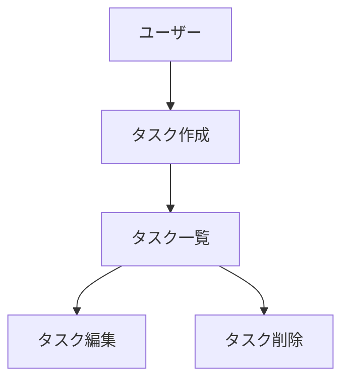

# CLAUDE.md (プロジェクトメモリ)

## 概要
開発を進めるうえで遵守すべき標準ルールを定義します。

## プロジェクト構造
本リポジトリはキーボードファームウェアフレームワーク専用のリポジトリです。

### ドキュメントマップ

#### 1. 永続ドキュメント (`docs/`)
アプリケーション全体の「**何を作るか**」「**どう作るか**」を定義する恒久的なドキュメント。
アプリケーションの基本設計や方針が変わらない限り更新されません。

##### **product-requirements.md** - プロダクト要求定義書
- プロダクトビジョンと目的
- ターゲットユーザと課題・ニーズ
- 主要な機能一覧
- 成功の定義
- ビジネス要件
- ユーザーストーリー
- 受け入れ条件
- 機能要件
- 非機能要件

##### **functional-design.md** - 機能設計書
- 機能ごとのアーキテクチャ
- システム構成図
- データモデル定義（ER図含む）
- コンポーネント設計
- ユースケース図、画面遷移図、ワイヤーフレーム
- API設計

##### **architecture.md** - 技術仕様書
- テクノロジースタック
- 開発ツールと手法
- 技術的制約と要件
- パフォーマンス要件

##### **repository-structure.md** - リポジトリ構造定義書
- フォルダ・ファイルの構成
- ディレクトリの役割
- ファイル配置ルール

##### **development-guidelines.md** - 開発ガイドライン
- コーディング規約
- 命名規則
- スタイリング規約
- テスト規約
- Git規約

##### **glossary.md** - ユビキタス言語定義
- ドメイン用語の定義
- ビジネス用語の定義
- UI/UX用語の定義
- 英語・日本語対応表
- コード上の命名規則

##### **packages/*.md** - 詳細設計書
- パッケージ実装レベルの仕様

#### 2. 作業単位ドキュメント（`.steering/[開発タイトル]/`）
特定の開発作業における「**今回何をするか**」を定義する一時的なステアリングファイル。
作業完了後は参照用として保持されますが、新しい作業では新しいディレクトリを作成します。

- **requirements.md** - 今回の作業の要求内容
  - 変更・追加する機能の説明
  - ユーザーストーリー
  - 受け入れ条件
  - 制約事項
- **design.md** - 変更内容の設計
  - 実装アプローチ
  - 変更するコンポーネント
  - データ構造の変更
  - 影響範囲の分析
- **tasklist.md** - タスクリスト
  - 具体的な実装タスク
  - タスクの進捗状況
  - 完了条件

###  ステアリングディレクトリの命名規約
```
.steering/[開発タイトル]/
```

**例**
- ./steering/phase1/
- ./steering/phase2/
- ./steering/phase3/


## 開発プロセス

### 初回セットアップ時の手順
#### 1. フォルダの作成
``` bash
mkdir -p docs
mkdir -p .steering
```

#### 2. 永続的ドキュメント作成（`docs/`)

アプリケーション全体の設計を定義します。
各ドキュメント作成後、必ず確認・承認を得てから次に進みます。

1. `docs/product-requirements.md` - プロダクト要求定義書
2. `docs/functional-design.md` - 機能設計書
3. `docs/architecture.md` - 技術仕様書
4. `docs/repository-structure.md` - リポジトリ構造定義書
5. `docs/development-guidlines.md` - 開発ガイドライン
6. `docs/glossary.md`- ユビキタス言語定義

**重要：** 1ファイルごとに作成後、必ず確認・承認を得てから次のファイル作成を行う。

#### 3. 初回実装用のステアリングファイル作成

初回実装用のディレクトリを作成し、実装に必要なドキュメントを配置します。

``` bash
mkdir -p .steering/initial-implementation
```

作成するドキュメント
1. `.steering/initial-implementation/requirements.md` - 初回実装の要求
2. `.steering/initial-implementation/design.md` - 実装設計
3. `.steering/initial-implementation/tasklist.md` - 実装タスク

#### 4. 環境セットアップ

#### 5. 実装開始

`.steering/initial-implementation/tasklist.md`に基づいて実装を進めます。

#### 6. 品質チェック

### 機能追加・修正時の手順

#### 1. 影響分析

- 永続的ドキュメント（`docs/`）への影響を確認
- 変更が基本設計に影響する場合は `docs/` を更新

#### 2. ステアリングディレクトリを作成

新しい作業用のディレクトリを作成します。

``` bash
mkdir -p .steering/[開発タイトル]
```
#### 3. 作業ドキュメント作成

作業単位のドキュメントを作成します。
各ドキュメント作成後、必ず確認・承認を得てから次に進みます。

作成するドキュメント
1. `.steering/[開発タイトル]/requirements.md` - 初回実装の要求
2. `.steering/[開発タイトル]/design.md` - 実装設計
3. `.steering/[開発タイトル]/tasklist.md` - 実装タスク

**重要：** 1ファイルごとに作成後、必ず確認・承認を得てから次のファイル作成を行う。

#### 4. 永続的ドキュメント更新（必要な場合のみ）

変更が基本設計に影響する場合、該当する `docs/` 内のドキュメントを更新します。

#### 5. 実装開始

`.steering/[開発タイトル]/tasklist.md` に基づいて実装を進めます。

#### 6. 品質チェック

## ドキュメント管理の原則

### 永続的ドキュメント(`docs/`)
- アプリケーションの基本設計を記述
- 頻繁に更新されない
- 大きな設計変更じのみ更新
- プロジェクト全体の「北極星」として機能

### 作業単位のドキュメント(`.steering/`)
- 特定作業・変更に特化
- 作業ごとに新しいディレクトリを作成
- 作業完了時は履歴として保持
- 変更の意図と経緯を記録

## 図表・ファイアグラムの記載ルール

### 記載場所
設計図やダイアグラムは、関連する永続ドキュメント内に直接記載します。
独立したdiagramsフォルダは作成せず、手間を最小限に抑えます。

**配置例：**
- ER図、データモデル → `docs/functional-design.md` 内に記載
- ユースケース図 → `docs/functional-design.md` 内に記載
- 画面遷移図、ワイヤーフレーム → `docs/functional-design.md` 内に記載
- システム構成図 → `docs/functional-design.md` または `docs/architecture.md` 内に記載

### 記述形式
1. **Mermaid記法(推奨)**
    - Markdownに直背rつ埋め込める
    - バージョン管理が用意
    - ツール不要で編集可能



2. **ASCIIアート**
    - シンプルな図表に仕様
    - テキストエディタで編集可能

```text
┌─────────────────────────────────────────────┐
│  main.go                                    │
│  エントリポイント　                            │
└────────────────┬────────────────────────────┘
                 │ 呼び出し
┌────────────────▼────────────────────────────┐
│  engine/                                    │
│  メインループ（スキャン → 解決 → HID 送信）　　   │
└─────────────────────────────────────────────┘
```

3. **画像ファイル（必要な場合のみ）**
    - 複雑なワイヤーフレームやモックアップ
    - `docs/images/` フォルダに配置
    - PNGまたはSVG形式を推奨

### 図表の更新
- 設計変更時は対応する図表も同時に更新
- 図表とコードの乖離を防ぐ

## 注意事項

- ドキュメントの作成・更新は段階的に行い、各段階で承認を得る
- `.steering/`のディレクトリ名は[開発タイトル]で名確認識別できるようにする
- 永続的ドキュメントと作業単位のドキュメントを混同しない
- コード編恋語は必ずlint・型チェックを実施する
- 共通のデザインシステムを使用して統一感を保つ
- セキュリティを考慮したコーディング
- 図表は必要最小限にとどめ、メンテナンスコストを抑える